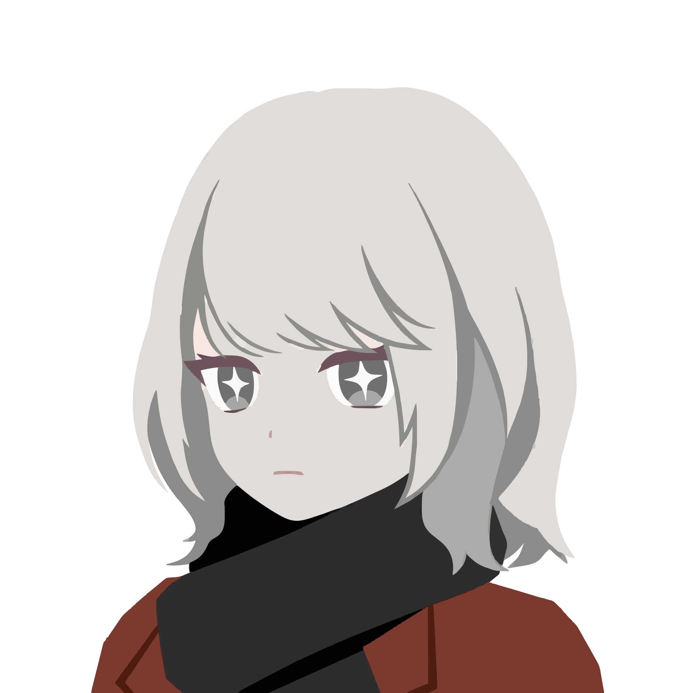
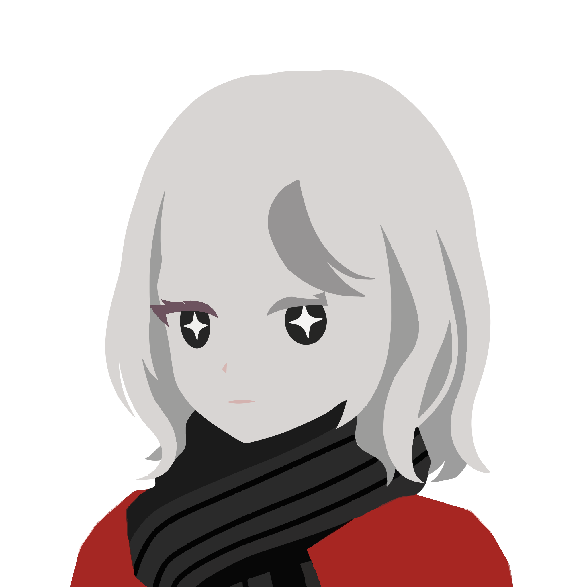

<div align="center">
  
  <h1>img2svg-bench</h1>
  <p><strong>A local-first benchmark harness for image-to-SVG tools, presets, and preprocessing pipelines.</strong></p>
  <p>
    <a href="https://github.com/Sunwood-ai-labs/img2svg-bench/actions/workflows/ci.yml"></a>
    <a href="https://sunwood-ai-labs.github.io/img2svg-bench/"></a>
    <a href="./LICENSE"></a>
    
    
    
  </p>
  <p>
    <strong>Language:</strong>
    <a href="./README.md">English</a> |
    <a href="./README.ja.md">日本語</a>
  </p>
</div>

## 🔍 Overview
`img2svg-bench` is a reproducible benchmark repository for comparing raster-image-to-SVG pipelines.

The repository currently ships a polished VTracer baseline with:

- optional bright-edge background removal
- multiple preset runs against the same inputs
- CSV summaries for timing and SVG complexity
- Markdown reports with embedded SVG previews
- bilingual documentation for setup, methodology, and extension

## 🎯 Why It Exists
Image-to-SVG work is often judged by eye alone, but a useful benchmark needs repeatable inputs, stable presets, and metrics that can be regenerated locally.

This repository focuses on that benchmark loop:

1. prepare one or more input images
2. optionally preprocess them
3. run a fixed set of SVG conversion presets
4. collect measurable outputs
5. generate a browsable comparison report

## ✨ Features
- multiple VTracer presets ranging from `poster` to `detail`
- background removal that preserves interior bright regions by flood-filling from the image edge
- benchmark summaries with runtime, file size, path count, unique fill count, and output dimensions
- local-first workflow that keeps private inputs and generated artifacts out of Git by default
- GitHub Pages-ready docs for public project onboarding

## 🖼 Generated Result Samples
These tracked SVGs are representative published outputs from the current VTracer baseline. The original experiment outputs live under `output/`, so the samples below are copied into `docs/public/results/` for GitHub and Pages rendering.

<table>
  <tr>
    <th>kiyoka_1 / clean</th>
    <th>kiyoka_1 / poster</th>
  </tr>
  <tr>
    <td></td>
    <td></td>
  </tr>
  <tr>
    <td><code>129.7 KB</code> / <code>93 paths</code> / <code>1.30 s</code></td>
    <td><code>61.1 KB</code> / <code>36 paths</code> / <code>0.44 s</code></td>
  </tr>
  <tr>
    <th>kiyoka_2 / clean</th>
    <th>kiyoka_2 / poster</th>
  </tr>
  <tr>
    <td></td>
    <td></td>
  </tr>
  <tr>
    <td><code>210.0 KB</code> / <code>123 paths</code> / <code>0.84 s</code></td>
    <td><code>108.2 KB</code> / <code>46 paths</code> / <code>0.51 s</code></td>
  </tr>
</table>

Also published in this repository:

- `kiyoka_1`: [default](./docs/public/results/kiyoka-1-default.svg), [cutout](./docs/public/results/kiyoka-1-cutout.svg), [polygon](./docs/public/results/kiyoka-1-polygon.svg), [detail](./docs/public/results/kiyoka-1-detail.svg), [binary_ink](./docs/public/results/kiyoka-1-binary-ink.svg)
- `kiyoka_2`: [default](./docs/public/results/kiyoka-2-default.svg), [cutout](./docs/public/results/kiyoka-2-cutout.svg), [polygon](./docs/public/results/kiyoka-2-polygon.svg), [detail](./docs/public/results/kiyoka-2-detail.svg), [binary_ink](./docs/public/results/kiyoka-2-binary-ink.svg)

See the [Reports docs](./docs/reports.md) for the full published preset matrix.

## 🚀 Quick Start
Install dependencies:

```powershell
uv sync
npm install
```

Optional preprocessing:

```powershell
uv run python scripts/remove_edge_background.py --inputs path/to/image1.png path/to/image2.jpg
```

Run VTracer experiments:

```powershell
uv run python scripts/vtracer_experiments.py --inputs output/preprocessed/image1.nobg.png output/preprocessed/image2.nobg.png
```

Build the Markdown comparison report:

```powershell
uv run python scripts/build_vtracer_report.py
```

Build the docs site:

```powershell
npm run docs:build
```

## 🗂 Repository Layout
```text
.
|- datasets/                  # Optional repo-managed benchmark datasets
|- docs/                      # Bilingual VitePress documentation
|- scripts/                   # Preprocessing, experiment, and report builders
|- output/                    # Local generated artifacts (ignored)
|- pyproject.toml             # UV / Python project metadata
`- package.json               # Docs tooling metadata
```

## 📊 Metrics Collected Today
- runtime per preset
- output SVG size
- path count
- unique fill count
- output width and height

These metrics are intentionally simple, but they make benchmark runs easy to compare and automate.

## 🛣 Roadmap
- add more runners beyond VTracer
- introduce dataset categories such as logos, characters, line art, photos, and diagrams
- add render-back image metrics and visual diff workflows
- separate fidelity scoring from editability scoring
- formalize runner and preset configuration formats

## 📚 Docs
- Site: [sunwood-ai-labs.github.io/img2svg-bench](https://sunwood-ai-labs.github.io/img2svg-bench/)
- Local docs entry: [docs/index.md](./docs/index.md)

## 🧭 Repository Policy
- local benchmark artifacts live under `output/` and are not committed
- local or private sample images are not published by default
- a curated public SVG sample set may be committed under `docs/public/results/` for README and docs rendering
- benchmark scripts are designed to run against your own local inputs

## ⚖️ License
This repository is released under the [MIT License](./LICENSE).
